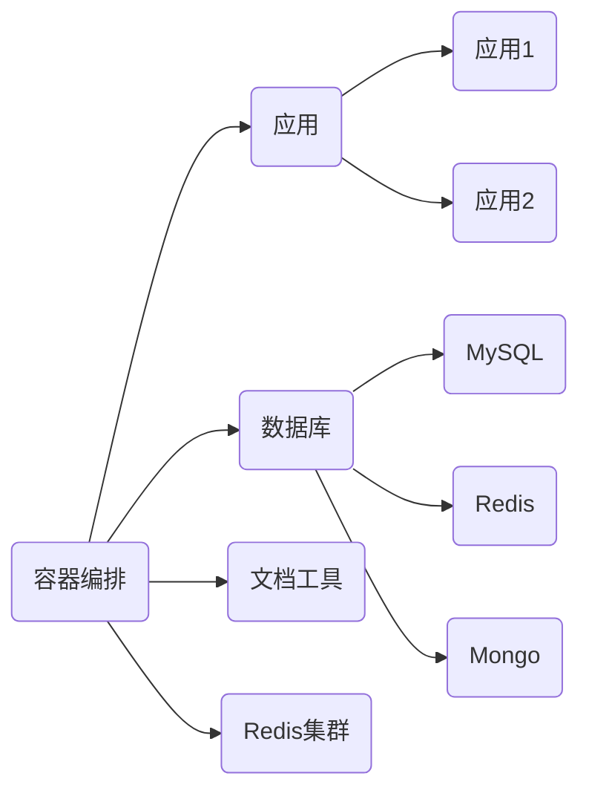

# dev_tool

开发工具容器化集合

#### 前言

使用容器化为开发及其开发环境赋能，一方面是 **简化环境配置** 提升开发效率，另一方面是 **保证环境一致性** 避免环境差异事故。

开发环境所有编排基于 `docker-compose` 编排组件。

#### 概览



#### 使用

配置已经集成与配置文件中，也就是 `docker-compose` 项目根目录上的 `.env` 文件，项目已经初始化配置模板，即 `.env.sample` ，拷贝成 `.env` 即可。

```shell
# 处理自定义配置文件
cp .env.sample

# 创建容器开发网络
docker network create dev-network

# 启动运行编排容器
docker-compose up -d
# or
docker-compose up -d ${container_name}

# 查阅编排服务概览
docker-compose ps
```


